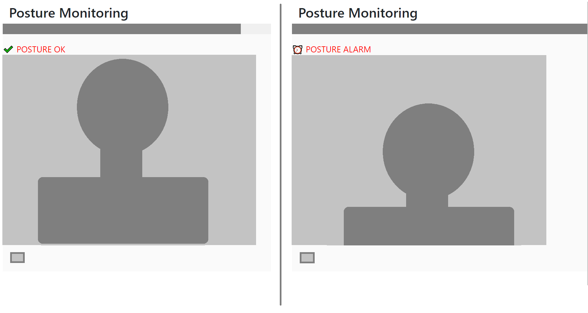

# Posture Detection inside browser using customvision.ai , tfjs and webcamjs

This is the sample code for my experiment on creating a posture detection system. It uses a webcam attached on top of a desktop monitor to continuously  monitor user's posture. If the user is slouching or tilting forward, the code generates an alarm.

This code should work in any modern browser. A faster computer should ensure smoother performance.

The model was trained using [customvision.ai](https://www.customvision.ai/) which requires you to write zero lines of code. If you can use email, you can probably train the model using customvision.ai (you will an Azure subscription though). You just need to upload bunch of images, label them  and press the train button !

Once I created the model, I exported it to tensorflowjs format. Then using some javascript client libraries I created a webpage that takes pictures of the user and checks for posture !

>Note: The current model is just a PoC one, may or maynot work correctly in your setup. I encourage you to train your own model and replace the following files: labels.txt , metadata_properties.json , model.sjon , cvexport.manifest and weights.bin

>Note: The code (index.html) needs to run from a webserver.

